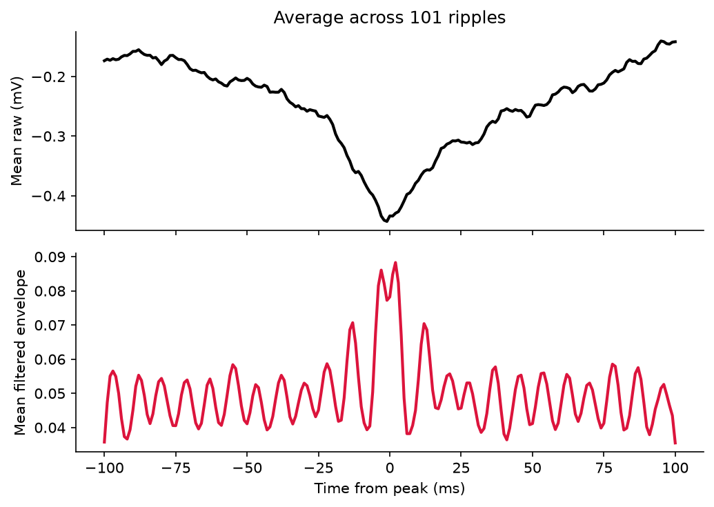

# Sharp-Wave Ripple Detector

A Python package for detecting hippocampal sharp-wave ripples (SWRs) in local field potential (LFP) recordings, ported from a MATLAB pipeline following the Buzsáki lab standard envelope-thresholding approach.



*Event-triggered average across 101 NREM ripples. Top: mean raw LFP showing 
the negative sharp wave (−0.38 mV). Bottom: mean ripple-band envelope peaking 
at time zero, confirming co-occurrence of sharp wave and ripple burst.

## What are sharp-wave ripples?

Sharp-wave ripples are brief (30–100 ms) high-frequency (100–300 Hz) oscillatory events in the hippocampus, most prominent during NREM sleep and quiet wakefulness. They are strongly implicated in memory consolidation and are a key readout in hippocampal electrophysiology.

## Why was this built?

I work on sleep-state classification in urethane-anesthetized rodents before and after intravenous cannabis delivery. This detector is used to quantify how SWR rate and morphology change pre- and post-drug. The pipeline was first developed in MATLAB and ported to Python for reproducibility and open sharing.

## Features

- Zero-phase Chebyshev Type I bandpass filtering to the ripple band (100–300 Hz)
- Dual-threshold envelope detection (edge + peak SD) with peak tracking
- NREM-like state classification via theta/delta power ratio
- Duration filter (default 30–100 ms)
- Precision / recall / F1 evaluation against expert-labeled ground truth
- Publication-ready visualization: detection trace, event grid, average waveform
- Validated on rodent CA1 LFP recorded with a 16-channel multiprobe
- Works on plain NumPy arrays — no proprietary dependencies

## Installation

```bash
git clone https://github.com/Layan-Fayad/ripple-detector.git
cd ripple-detector
pip install -e .
```

## Quickstart

```python
from rippledetect import detect_ripples, classify_nrem, gate_by_nrem

# lfp: 1D NumPy array in mV; fs: sampling rate in Hz
starts, ends, peaks = detect_ripples(lfp, fs=1000)
is_nrem, ratio, threshold = classify_nrem(lfp, fs=1000)
starts, ends, peaks = gate_by_nrem(starts, ends, peaks, is_nrem)

print(f"Detected {len(starts)} NREM ripples")
```

Run the end-to-end demo on synthetic data:

```bash
python notebooks/demo.py
```

## Method

1. **Bandpass filter** the LFP to 100–300 Hz (zero-phase Chebyshev Type I, order 4)
2. **Compute the amplitude envelope** via Hilbert transform and smooth with a 10 ms moving average
3. **Z-score** the envelope relative to the full recording
4. **Detect candidate events** where the envelope exceeds `edge_sd` (default 0.5 SD)
5. **Keep only events** whose peak exceeds `peak_sd` (default 3.0 SD)
6. **Apply duration filter** (default 30–100 ms)
7. **Classify NREM** via theta/delta power ratio (theta²/delta² < mean − 0.5 SD, sustained ≥ 10 s)
8. **Gate detections** to NREM-like periods only

Channel selection is guided by SWR-triggered CSD analysis — the recording channel is chosen as the one showing maximum ripple-band power and a current source at str. pyramidale (confirmed by the sharp wave sink in str. radiatum in the CSD).

### Parameters

| Parameter | Default | Description |
|---|---|---|
| `low`, `high` | 100, 300 Hz | Ripple band |
| `edge_sd` | 0.5 SD | Boundary threshold |
| `peak_sd` | 3.0 SD | Peak threshold |
| `smooth_ms` | 10 ms | Envelope smoothing window |
| `min_duration_ms` | 30 ms | Minimum event duration |
| `max_duration_ms` | 100 ms | Maximum event duration |

## Validation

Detected events were validated by event-triggered averaging across all detected ripples. The mean raw LFP shows a clear negative sharp wave (−0.38 mV) co-occurring with a ripple-band envelope peak (~0.085 mV) centered at time zero — consistent with canonical SWR morphology. Approximately 153 NREM ripples were detected per 42-minute baseline recording at 1000 Hz.

## Repository structure